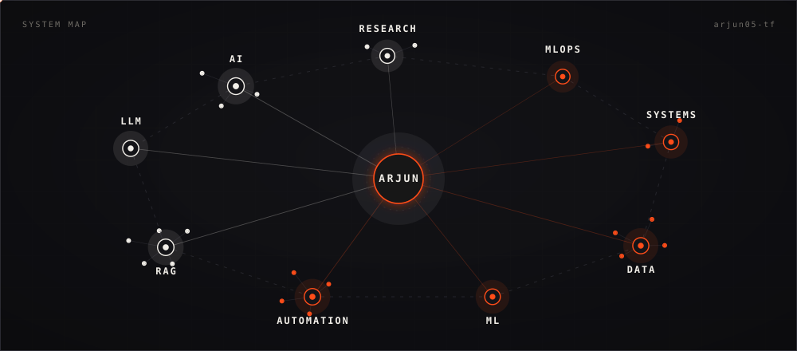
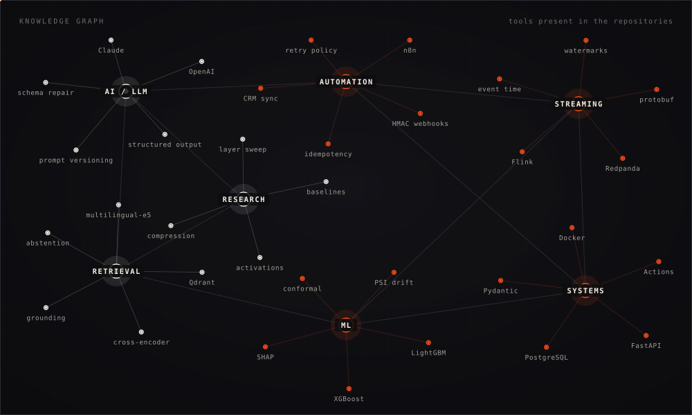
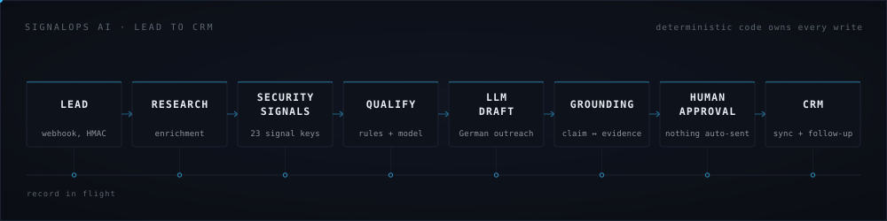
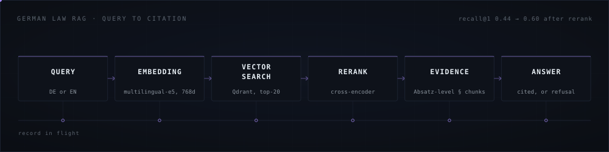
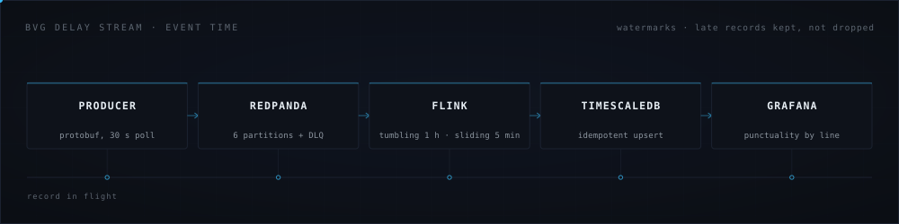
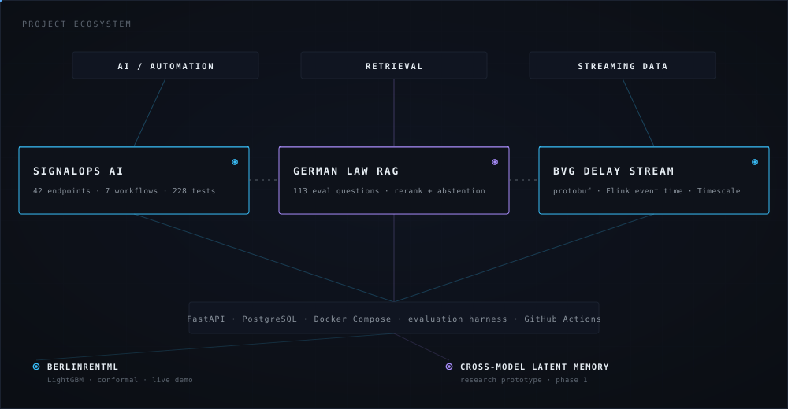
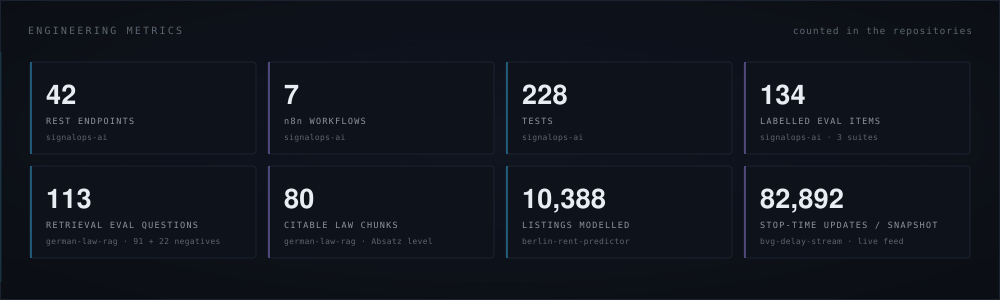
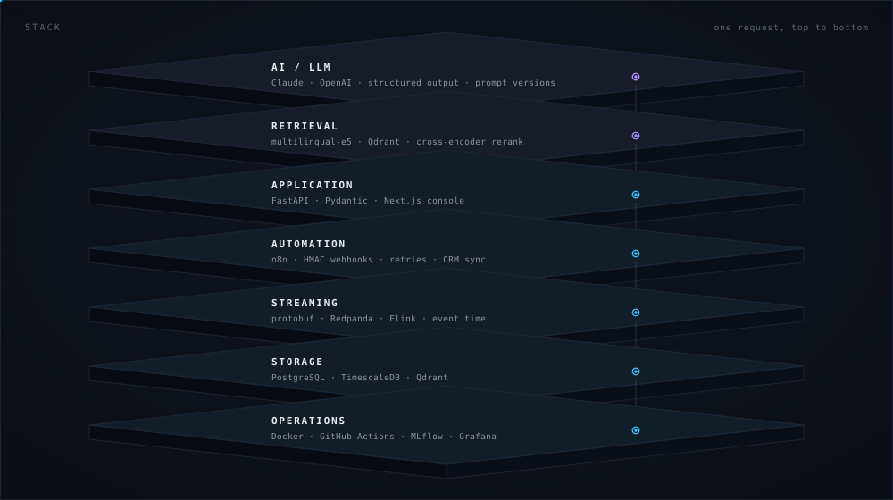
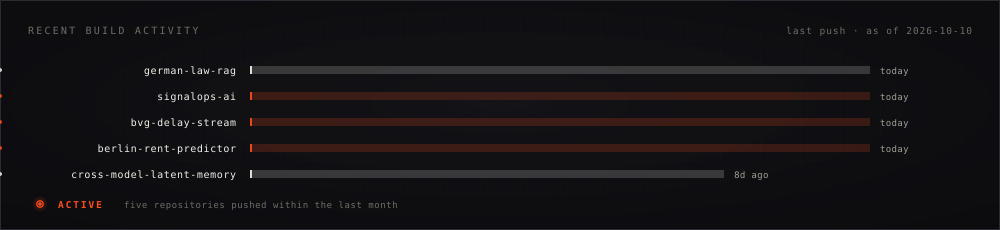

# ARJUN VINOD PATIL

**AI/ML Engineer · AI Automation · Data Engineering** [Berlin]

I build AI systems, workflow automation and data infrastructure, and I attach an evaluation
harness to each one so the claims can be checked.

[LinkedIn](https://www.linkedin.com/in/arjun-vinod-patil-982266310) · [Email](mailto:arjunpatil02814@gmail.com) · [GitHub](https://github.com/arjun05-tf)

---

## Current focus

| Layer | What I work on |
|---|---|
| **AI systems** | LLM pipelines with structured output, prompt versioning, grounding validation, refusal behaviour |
| **Retrieval** | Multilingual embeddings, vector search, cross-encoder reranking, citation-level evidence |
| **Automation** | n8n workflows, signed webhooks, idempotent intake, retry and throttle policy, CRM sync |
| **Data systems** | Protobuf on the wire, Kafka-protocol streaming, Flink event-time windows, TimescaleDB |
| **ML / MLOps** | Gradient boosting, leakage-aware evaluation, conformal intervals, SHAP, MLflow, drift checks |
| **Research** | Model-internal representations, compression, controlled baselines |

---

## Knowledge graph

Every node below is a tool or concept that appears in the repositories on this profile, not a wishlist.

---

## Featured projects

### 1 · SignalOps AI: grounded B2B automation

Lead research, enrichment, qualification and outreach automation, built as the internal sales/ops
stack a small cybersecurity vendor could run. Leads arrive by signed webhook, get enriched and
scored by a hybrid of deterministic rules and model judgement, and every factual claim in the
generated German email is resolved back to a stored evidence item before a human approves it.
Nothing is sent without a click.

- **The model never owns the number.** The qualification prompt is forbidden from emitting a total
  score; deterministic code owns scoring arithmetic, validation, routing and every database write.
- **Grounding validation as a gate, not a prompt.** Drafts whose claims do not resolve to evidence
  are rejected before they reach the approval queue, with the validator's objection attached.
- **Evaluation in CI.** 3 suites over 134 labelled items, prompt v1 against v2, run through the
  real code path with quality gates.
- **Failure is visible.** Seeded fault injection puts real failed runs on the dashboard instead of
  a demo where everything succeeds.

`FastAPI` `Pydantic` `PostgreSQL` `n8n` `Anthropic` `OpenAI` `Next.js 16` `Docker` `GitHub Actions`

**42 REST endpoints · 7 n8n workflows · 9 console screens · 228 tests**
Default provider is a deterministic simulator, so the stack runs and CI reproduces with no credentials.

[→ Repository](https://github.com/arjun05-tf/signalops-ai)

---

### 2 · German Law RAG: retrieval you can cite

Question answering over the German working time act (ArbZG) with answers sourced to the exact
paragraph `§ 4 ArbZG`, not a page number. Official Bundesrecht XML is parsed at *Absatz* level,
because that is the smallest citable unit in German law, and retrieval is measured rather than
assumed.

- **Reranking is a ranking fix, and the data says so.** English recall@1 went 0.29 → 0.60 while
  German stayed at 0.59, closing a 30-point cross-lingual gap. The correct paragraph was already
  being retrieved and ordered badly.
- **Abstention probe.** Cosine similarity separates answerable from unanswerable questions at
  AUROC 0.66; a cross-encoder reaches 0.83. Embedding similarity measures topical proximity, not
  sufficiency of evidence.
- **Honest confounds in the README.** The reranked run also widened the candidate pool from 5 to
  20, so part of the recall@5 gain is pool size, not the reranker stated, not hidden.

`Qdrant` `multilingual-e5-base` `cross-encoder reranking` `gpt-4o-mini` `Python`

**80 citable chunks · 113 evaluation questions (91 answerable + 22 negatives) · recall@1 0.44 → 0.60 · MRR 0.585 → 0.722**

[→ Repository](https://github.com/arjun05-tf/german-law-rag)

---

### 3 · BVG Delay Stream: event-time transit punctuality

A real-time pipeline over the VBB/BVG GTFS-Realtime feed that computes punctuality by line,
station and hour on **event time**, and serves it on a Grafana dashboard. Whole stack runs under
`docker compose` on a laptop.

- **Event time is the stop time, not the entity timestamp.** Entity timestamps inside one snapshot
  span more than four hours, which would force a watermark lag of hours.
- **Late records are captured, not dropped**, side output into a `late_events` table, visible on
  the dashboard next to the on-time aggregates.
- **Protobuf with a schema registry** pinned to `BACKWARD`, a dead-letter topic written by both the
  producer and the job, and an idempotent upsert sink.

`Python` `protobuf` `Redpanda (Kafka API)` `Apache Flink (Java)` `TimescaleDB` `Grafana` `Docker`

**6 partitions · tumbling 1 h + sliding 1 h/5 min windows · 5,021 trip updates and 82,892 stop-time updates per feed snapshot**
Throughput and latency figures are deliberately blank in the repo until a full 24-hour run is measured.

[→ Repository](https://github.com/arjun05-tf/bvg-delay-stream)

---

## How the projects connect

Different domains, one substrate: a typed API, a database that owns the truth, containers, CI, and
an evaluation harness that produces numbers I am willing to publish.

---

## Engineering metrics

Every figure is counted in the repository named under it. No stars, no follower counts, no
unverifiable totals.

---

## Stack

| | |
|---|---|
| **AI / LLM** | Claude · OpenAI · structured output with schema repair · versioned prompts · grounding validation |
| **Retrieval** | multilingual-e5-base · Qdrant · cross-encoder reranking · abstention analysis |
| **ML** | Python · scikit-learn · LightGBM · XGBoost · SHAP · split-conformal intervals |
| **Data** | protobuf · Redpanda (Kafka API) · Apache Flink · TimescaleDB · PostgreSQL |
| **Backend** | FastAPI · Pydantic · SQLAlchemy · Alembic · HMAC-signed webhooks |
| **Automation** | n8n · idempotent intake · retry and throttle policy · CRM sync |
| **Infrastructure** | Docker Compose · GitHub Actions · MLflow · Grafana · pytest · ruff · mypy |
| **Frontend** | Next.js · React · TypeScript · Tailwind |

---

## Research and experimentation

**Cross-Model Latent Memory Transfer**: `RESEARCH PROTOTYPE · PHASE 1 OF 6 · NO RESULTS YET`

Can task-relevant information inside a small language model be extracted, compressed and used by a
separate, stateless model, with the original text, KV cache and history discarded? Activation
extraction and memory injection into a target model are implemented; the controlled dataset,
baselines (zero-context, full-context, RAG, KV-cache transfer) and metrics information retention
ratio and compression ratio are specified and not yet run. Open questions: how small the memory
can get before performance drops, which layers transfer best, and whether a representation from one
architecture decodes in another. Joint work with Anuj Dalvi.

[→ Repository](https://github.com/arjun05-tf/cross-model-latent-memory)

**German Law RAG**: `EVALUATED SYSTEM · ONGOING`

Beyond the shipped pipeline, the repository carries two measured studies: cross-lingual ranking
failure and retrieval-confidence abstention. In progress: claim-level evidence attribution, where
each sentence of an answer is scored against the retrieved paragraphs instead of the answer as a
whole. Implemented, awaiting hand-labelled ground truth. 22 negatives are enough to show separation
exists, not enough to calibrate a threshold, that is the next dataset.

---

## Supporting projects

**BerlinRentML**: rent prediction validated on postal codes the model never saw.
10,388 cleaned Berlin listings, LightGBM at R² 0.880 on a random split and 0.836 on a postal-code
grouped split, which is the number that counts; split-conformal 90% intervals covering 88.5% of
test listings; SHAP attribution, MLflow tracking and a PSI drift check over logged requests.
`LightGBM` `scikit-learn` `FastAPI` `Streamlit` `MLflow` `Docker`
[Repository](https://github.com/arjun05-tf/berlin-rent-predictor) · [Live demo](https://berlin-rent-predictor.vercel.app)

---

## Build activity

---

## Currently building

- **signalops-ai**: grounded outreach automation; latest work on the security-vendor ICP layer
- **berlin-rent-predictor**: deployment of the portable model behind the live demo
- **cross-model-latent-memory**: latent memory injection and the comparative baseline

---

**Open to AI/ML engineering, AI automation and data engineering work.**

[LinkedIn](https://linkedin.com/in/arjun-patil-982266310) · [arjunpatil02814@gmail.com](mailto:arjunpatil02814@gmail.com)

Diagrams are generated from <a href="assets/build_assets.py">assets/build_assets.py</a>. Activity snapshot taken 2026-10-05.

